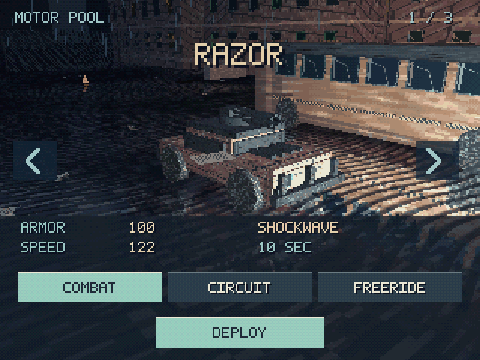
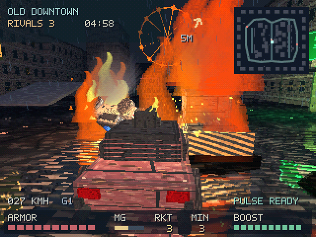
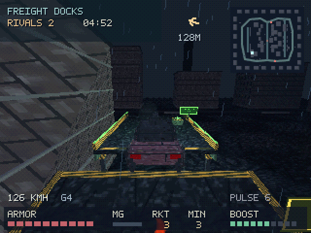

# Grave Circuit

Created by **torunum**.

A retro-style single-player vehicle combat game set in a rain-soaked city.

Three distinct vehicles. Armed circuit racing. Rooftop routes and hidden supplies.

## Screenshots

## Play

Open `index.html` in a modern desktop browser. An internet connection is required to load Three.js 0.180.0 from the pinned CDN URL. No build step is required.

Choose RAZOR, BREAKER or STATIC, then choose COMBAT, CIRCUIT or FREERIDE.

- COMBAT: eliminate three rivals before the time limit.
- CIRCUIT: compete in a three-lap armed race.
- FREERIDE: explore ramps, rooftops, shortcuts and supply caches.

## Controls

| Action | Input |
| --- | --- |
| Drive | W/A/S/D or arrow keys |
| Handbrake | Space |
| Boost | Shift |
| Minigun | Left mouse button or Ctrl |
| Missile | E |
| Vehicle special | Q |
| Rear mine | F |
| Recover stuck vehicle | R |
| Camera | C |
| Pause | Escape |

In the garage, Left/Right selects a vehicle, Up/Down selects a mode, and Enter deploys. Menus also accept mouse input. Sound starts after interaction; volume is available in the pause menu.

## Notes

Desktop keyboard and mouse are required. This release is a single-player prototype; it does not include multiplayer or touch-driving controls. Sound effects are procedurally synthesized.

The preview is captured from the running game, with scenes selected to show the garage, combat and rooftop route. It is not a continuous race replay.

## Third-Party Software

Rendering uses Three.js 0.180.0, licensed under MIT. Its notice is preserved in `THIRD-PARTY-LICENSE.txt`. This notice concerns the library, not game creator credit.
